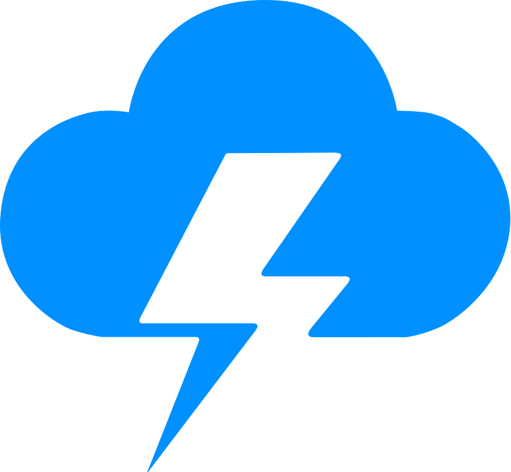

<div align="center">
  
  <h1>StormSale ⚡</h1>
  <p><strong>The Future of Trustless Affiliate Marketing on Stellar</strong></p>

[](https://opensource.org/licenses/MIT)
[](https://react.dev/)
[](https://stellar.org/)
[](https://soroban.stellar.org/)
</div>

<br />

## 📖 Overview

StormSale is a cutting-edge Web3 affiliate marketing platform built on the **Stellar Network** utilizing **Soroban Smart Contracts**. It revolutionizes the collaboration between Advertisers and Affiliates by replacing traditional, opaque tracking systems with transparent, trustless, and cryptographically secure on-chain escrows.

By leveraging Stellar's low fees and sub-second finality, StormSale ensures instant commission settlements while maintaining strict data privacy through advanced on-chain encryption algorithms.

## ✨ Core Features

- **🛡️ Cryptographically Secure Escrow:** Advertisers lock commissions into Soroban smart contracts. Funds are only released upon cryptographic verification of a valid sale, eliminating chargeback fraud and payment delays.
- **⚡ Sub-Second Finality:** Powered by the Stellar consensus protocol, campaign deployments, sale logging, and affiliate payouts settle in under 5 seconds with fractions of a cent in fees.
- **🔒 On-Chain Privacy:** Affiliate data and lead information are secured using hybrid AES + Public Key encryption directly on-chain, ensuring NIST/ISO compliant data handling.
- **📊 Role-Based Command Centers:**
  - **Advertisers:** Manage smart contracts, deploy new campaigns, and track on-chain ROI.
  - **Affiliates:** Track encrypted referrals, claim escrowed payouts, and monitor performance.
  - **Auditors:** Transparently verify contract integrity without exposing PII (Personally Identifiable Information).
- **🎨 Premium UI/UX:** Built with React 19, Tailwind CSS v4, and Framer Motion for a stunning, responsive, and deeply engaging user experience.

## 🏗️ Architecture & Tech Stack

StormSale is composed of a decentralized frontend interacting with Soroban smart contracts.

### Frontend

- **Framework:** React 19, TypeScript, Vite
- **Styling:** Tailwind CSS v4, UI Components (Radix UI)
- **Animations:** Framer Motion
- **Web3 Integration:** Stellar Freighter Wallet, `@stellar/freighter-api`

### Smart Contracts (Soroban)

- **Language:** Rust
- **Network:** Stellar Testnet / Mainnet
- **Tooling:** Soroban CLI, Stellar SDK

## 🚀 Getting Started

### Prerequisites

- **Node.js** (v18+ recommended)
- **npm** or **yarn**
- **Rust** (for compiling Soroban contracts)
- **Soroban CLI** installed

### Local Development Setup

1. **Clone the repository:**

   ```bash
   git clone https://github.com/yourusername/stormsale.git
   cd stormsale
   ```

2. **Install frontend dependencies:**

   ```bash
   npm install
   ```

3. **Start the development server:**
   ```bash
   npm run dev
   ```
   _The app will be running at `http://localhost:5173`._

### Smart Contract Deployment

1. Navigate to the contracts directory:
   ```bash
   cd StormSale-contracts
   ```
2. Build the Rust contracts:
   ```bash
   soroban contract build
   ```
3. Deploy to Stellar Testnet (requires a funded testnet account):
   ```bash
   soroban contract deploy --wasm target/wasm32-unknown-unknown/release/stormsale.wasm --source <YOUR_IDENTITY> --network testnet
   ```

## 🤝 Contributing

We believe in the power of open source and welcome contributions from the community!

1. Fork the repository.
2. Create a new branch: `git checkout -b feature/your-feature-name`.
3. Commit your changes: `git commit -m "feat: Add some feature"`.
4. Push to the branch: `git push origin feature/your-feature-name`.
5. Open a Pull Request detailing your changes.

Please ensure your code adheres to our styling guidelines and passes all existing tests.

## 📄 License

This project is licensed under the MIT License - see the [LICENSE](LICENSE) file for details.

---

<div align="center">
  <p>Built with ❤️ for the Web3 Ecosystem.</p>
</div>
