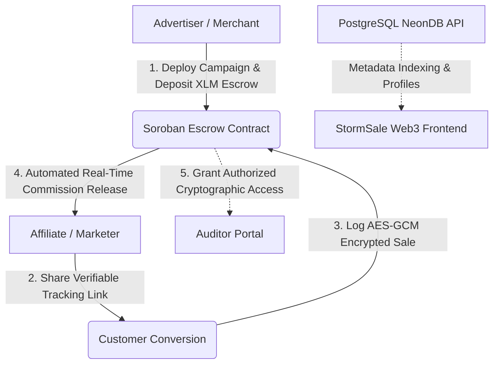

<div align="center">
  
  <h1>StormSale ⚡</h1>
  <p><strong>The Next-Generation Trustless Affiliate Protocol on Stellar & Soroban</strong></p>

[](LICENSE)
[](https://react.dev/)
[](https://stellar.org/)
[](https://soroban.stellar.org/)
[](https://vitest.dev/)
[](Dockerfile)
</div>

<br />

## 📖 Executive Summary

**StormSale** is a decentralized Web3 affiliate marketing protocol built on the **Stellar Network** utilizing **Soroban Smart Contracts**. It revolutionizes collaboration between Merchants (Advertisers), Marketers (Affiliates), and Compliance Teams (Auditors) by eliminating chargeback fraud, opaque tracking links, and 30-day payment holdbacks through automated on-chain budget escrows.

By leveraging Stellar's 5-second ledger finality and negligible transaction costs, StormSale guarantees instant commission disbursements the moment a verifiable conversion occurs.

---

## 🏗️ System Architecture



### Core Technology Stack

- **Frontend Framework:** React 19, TypeScript, Vite, Tailwind CSS, Framer Motion, Radix UI Primitives.
- **Web3 Engine:**
  - **Stellar SDK:** `@stellar/stellar-sdk` (v13+) for Soroban RPC simulation, fee estimation, and transaction submission.
  - **Freighter API:** `@stellar/freighter-api` for desktop browser extension signing.
  - **Albedo Protocol:** Native web popup bridge for zero-install mobile wallet signing (iOS Safari & Android Chrome).
  - **xBull SDK:** Hardware-wallet compatible Stellar wallet support.
- **Smart Contracts:** Soroban Rust (`#![no_std]`), persistent storage escrows with TTL auto-bump strategy.
- **Backend & Database:** Node.js / Express, Prisma ORM, Serverless PostgreSQL (Neon).
- **Security & Standards:** NIST SP 800-53 (AC-3), AES-256-GCM client-side encryption, ECDH key encapsulation.

---

## 🌐 Universal Multi-Wallet Architecture

StormSale features a native, zero-friction multi-wallet authentication layer supporting both desktop and mobile web environments:

| Wallet           | Type              | Target Environment                             | Key Feature                                                            |
| :--------------- | :---------------- | :--------------------------------------------- | :--------------------------------------------------------------------- |
| **Albedo**       | Web Popup Bridge  | Mobile (iOS Safari & Android Chrome) + Desktop | **Zero installation required.** Direct on-chain signing via web popup. |
| **Freighter**    | Browser Extension | Desktop (Chrome, Brave, Firefox)               | Official Stellar Development Foundation wallet.                        |
| **xBull**        | Extension & Web   | Desktop & Mobile                               | Multi-account management and hardware key support.                     |
| **Demo Account** | 1-Tap Sandbox     | Any Browser                                    | Pre-funded with **10,000 testnet XLM** for instant evaluation.         |
| **Watch Mode**   | Read-Only Key     | Any Browser                                    | Enter any Stellar public key (`G...`) to view metrics and campaigns.   |

---

## 📱 Mobile & Tablet Responsive Design

The interface is engineered with a mobile-first philosophy:

- **Touch Navigation Drawer:** Replaces desktop sidebars on viewports `< 1024px` with a sticky mobile header and animated slide-down tab switcher.
- **Adaptive HUD:** Displays live Stellar network status, compact address pills (`G...4xyz`), active wallet connector type, and real-time XLM balances.
- **Fluid Typography & Visuals:** Responsively scaled hero headers and an animated 3D network globe that scales smoothly from smartphones to widescreen monitors.

---

## 🎯 Role-Based Command Centers (RBAC)

StormSale organizes platform features into dedicated personas:

### 1. 📢 Advertiser Pro

- **Deploy Smart Campaigns:** Deploy on-chain Soroban escrow contracts with configurable budgets, commission percentages, and clearing periods.
- **Log Encrypted Conversions:** Seal customer sale metadata using AES-256-GCM client-side encryption before writing transaction hashes to the ledger.
- **Grant Audit Access:** Encapsulate decryption keys for compliance officers and regulatory auditors.
- **Campaign Analytics:** Track conversion rates, gross volume, and escrow solvency in real time.

### 2. 🤝 Affiliate Pro

- **Campaign Marketplace:** Explore active campaigns with verified on-chain budget reserves.
- **Referral Generation:** One-click generation of verifiable cryptographic tracking links.
- **Real-Time Payouts:** Claim matured commissions directly into your connected Stellar wallet.
- **Performance Intelligence:** Live ledger analytics on clicks, conversions, and earnings.

### 3. 🔍 Auditor Enterprise

- **Access Verification Console:** Two-column cryptographic verification suite with quick-fill presets from pending audit queues.
- **In-Page Payload Decryption:** Decrypt and inspect authorized sale records using verified auditor keys.
- **Immutable Audit Trail:** Review chronological verification history and download tamper-proof audit certificates.
- **Compliance Reporting:** Live scorecard covering NIST SP 800-53, ISO/IEC 27001, SOC 2 Type II, and FIPS 140-2.

---

## 🚀 Quick Start Guide

### Prerequisites

- **Node.js:** v18.0.0 or higher (v20+ recommended)
- **npm:** v10.0.0 or higher
- **Stellar Wallet:** [Freighter](https://www.freighter.app/) (Desktop) or [Albedo](https://albedo.link/) (Mobile / Web)

### 1. Clone & Install

```bash
git clone https://github.com/StormSale/StormSale.git
cd StormSale
npm install
```

### 2. Configure Environment

Create a `.env` file in the project root:

```env
VITE_STELLAR_NETWORK=TESTNET
VITE_HORIZON_URL=https://horizon-testnet.stellar.org
VITE_SOROBAN_RPC_URL=https://soroban-testnet.stellar.org
VITE_NETWORK_PASSPHRASE="Test SDF Network ; September 2015"
VITE_CONTRACT_ADDRESS=CA7QW5KXGPTR4N2K9J2L77XLMESCROW9999STORMTESTNET1
```

### 3. Start Local Development

```bash
npm run dev
```

Visit `http://localhost:5173` to launch the application.

### 4. Running with Docker

```bash
# Build the production container
docker build -t stormsale-frontend .

# Run the container
docker run -p 5173:5173 stormsale-frontend
```

---

## 🧪 Testing & Validation

StormSale maintains high software reliability with automated unit testing and type verification:

```bash
# Run Vitest test suite
npm test -- --run

# Run TypeScript typecheck & production bundle
npm run build

# Run code formatting & linting
npm run lint
npm run format
```

---

## 📁 Repository Directory Structure

```
StormSale/
├── .github/                 # GitHub templates, workflows, & community standards
│   ├── ISSUE_TEMPLATE/      # Bug reports, feature proposals, and config requests
│   └── PULL_REQUEST_TEMPLATE.md
├── public/                  # Static assets (favicons, logos)
├── src/
│   ├── assets/              # Branding graphics and vector illustrations
│   ├── components/          # Modular component library
│   │   ├── advertiser/      # Campaign creation, sale logging, grant access forms
│   │   ├── affiliate/       # Campaigns list, link generators, commission claims
│   │   ├── auditor/         # Verify access console, audit history, compliance
│   │   ├── shared/          # Header, Sidebar, ConnectWalletModal, ThemeToggle
│   │   └── ui/              # Radix UI & Tailwind component primitives
│   ├── config/              # Stellar network and Soroban RPC configurations
│   ├── context/             # Web3Context (Soroban invocations & wallet state)
│   ├── lib/                 # Stellar SDK engine, Albedo bridge, crypto utilities
│   ├── pages/               # Landing, Dashboard, Advertiser, Affiliate, Auditor
│   └── utils/               # API clients, network health checks, helper functions
├── CONTRIBUTING.md          # Contribution guidelines
├── CODE_OF_CONDUCT.md       # Contributor Covenant code of conduct
├── SECURITY.md              # Vulnerability reporting protocol
└── LICENSE                  # MIT License
```

---

## 👥 Core Maintainers

|                                         Avatar                                         |                                  Name / Role                                   |                      GitHub                      |                 Contact                 |
| :------------------------------------------------------------------------------------: | :----------------------------------------------------------------------------: | :----------------------------------------------: | :-------------------------------------: |
|  | **Jibril Raji Qasim (AJDEV)**<br/>_Lead Full-Stack & Smart Contract Developer_ | [@AbuJulaybeeb](https://github.com/AbuJulaybeeb) | [Telegram](https://t.me/AJDEV_Official) |

---

## 🤝 Contributing

We welcome community contributions! Please review [CONTRIBUTING.md](CONTRIBUTING.md) and [SECURITY.md](SECURITY.md) before submitting pull requests.

---

## 📄 License

This project is open-source software licensed under the **[MIT License](LICENSE)**.
