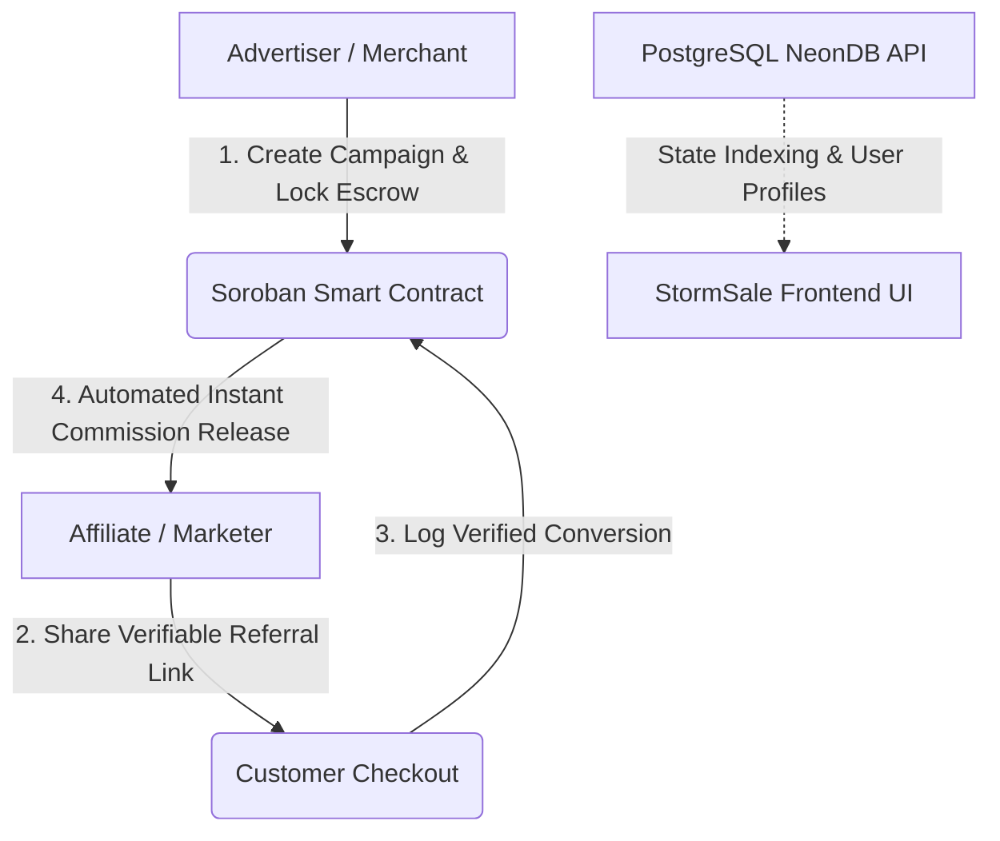

<div align="center">
  
  <h1>StormSale ⚡</h1>
  <p><strong>The Future of Trustless Affiliate Marketing on Stellar</strong></p>

[](LICENSE)
[](https://react.dev/)
[](https://stellar.org/)
[](https://soroban.stellar.org/)
[](Dockerfile)
</div>

<br />

## 📖 Overview

**StormSale** is a decentralized Web3 affiliate marketing protocol built on the **Stellar Network** utilizing **Soroban Smart Contracts**. It revolutionizes collaboration between Merchants (Advertisers) and Marketers (Affiliates) by eliminating chargeback fraud, opaque tracking links, and net-30 payment delays through automated on-chain budget escrows.

By leveraging Stellar's sub-second finality and negligible transaction costs, StormSale guarantees instant commission payouts the moment a verifiable conversion occurs.

---

## 🏗️ System Architecture



### Technology Stack

- **Frontend App:** React 19, TypeScript, Vite, Tailwind CSS, Framer Motion, Radix UI Primitives.
- **Web3 Connector:** Stellar Freighter Wallet (`@stellar/freighter-api`, `@stellar/stellar-sdk`).
- **Core Ledger:** Soroban Smart Contract (Rust, `#![no_std]`).
- **Backend Services:** Node.js / Express, Prisma ORM, Neon Serverless PostgreSQL.
- **DevOps:** Docker Alpine multi-stage containerization.

---

## ✨ Core Features

- **🛡️ Escrowed Campaign Budgets:** Advertisers deposit upfront budgets locked into the Soroban escrow. Commissions are guaranteed and mathematically bounded.
- **⚡ Instant Settlements:** Payouts settle in under 5 seconds with fractions of a cent in fees on Stellar Testnet and Mainnet.
- **🔒 Cryptographic Integrity:** Conversions are verified on-chain, preventing affiliate tracking spoofing and merchant default.
- **📊 Role-Based Command Centers:**
  - **Advertisers:** Deploy campaigns, top up budgets, and monitor conversion metrics.
  - **Affiliates:** Track referrals, review commissions, and execute instant payouts to Freighter wallets.
- **🐳 Cloud-Native & Containerized:** Single-command local launch with Docker and automated schema synchronization.

---

## 🚀 Getting Started

### Prerequisites

- **Node.js**: v18.0.0 or higher
- **npm**: v10+
- **Freighter Wallet**: [Browser Extension](https://www.freighter.app/)

### 1. Local Development Setup

```bash
# Clone the repository
git clone https://github.com/StormSale/StormSale.git
cd StormSale

# Install dependencies
npm install

# Configure environment variables
cp .env.example .env

# Run the development server
npm run dev
```

The application will be running locally at `http://localhost:5173`.

### 2. Running via Docker

```bash
# Build the production container
docker build -t stormsale-frontend .

# Run the container
docker run -p 5173:5173 stormsale-frontend
```

---

## 🧪 Quality & Engineering Standards

We enforce strict automated formatting, type-safety, and linting standards:

```bash
# Run linter
npm run lint

# Format codebase
npm run format

# Run production build validation
npm run build
```

---

## 👥 Maintainers & Lead Developers

|                                         Avatar                                         |                                  Name / Role                                   |                      GitHub                      |                 Contact                 |
| :------------------------------------------------------------------------------------: | :----------------------------------------------------------------------------: | :----------------------------------------------: | :-------------------------------------: |
|  | **Jibril Raji Qasim (AJDEV)**<br/>_Lead Full-Stack & Smart Contract Developer_ | [@AbuJulaybeeb](https://github.com/AbuJulaybeeb) | [Telegram](https://t.me/AJDEV_Official) |

---

## 🤝 Contributing

We welcome contributions from the open-source community! Please review our [CONTRIBUTING.md](CONTRIBUTING.md) guidelines and [SECURITY.md](SECURITY.md) policy before submitting pull requests.

---

## 📄 License

This project is licensed under the **MIT License** - see the [LICENSE](LICENSE) file for details.
